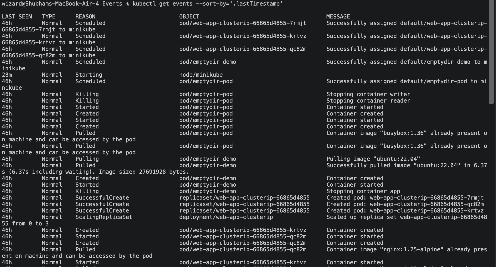
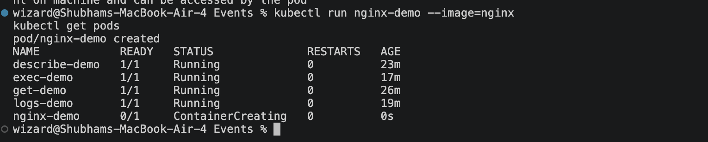
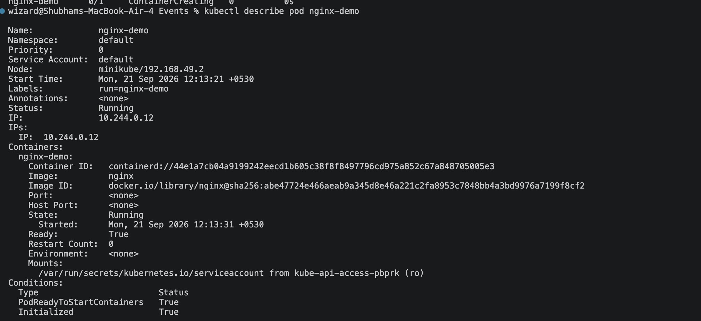
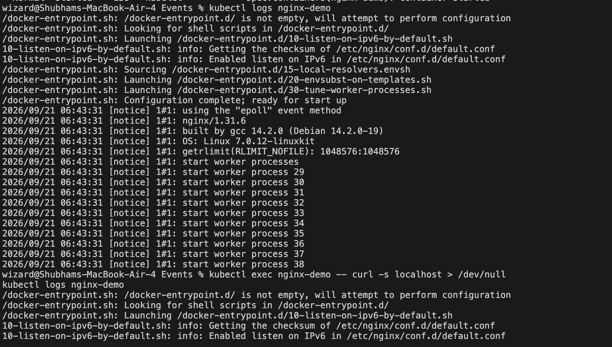
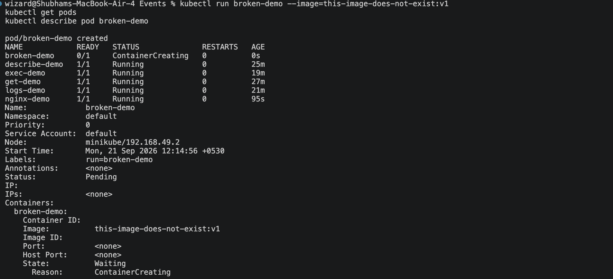

# Kubernetes Events and Logs

## What is an Event?

A Kubernetes **Event** is a short, timestamped record that the cluster creates to
describe *what happened to an object* — for example a Pod being scheduled, an image
being pulled, a container starting, or a failure such as `ImagePullBackOff`.

- Generated by the control plane components (scheduler, kubelet, controllers).
- Namespaced and attached to a specific object (Pod, Deployment, Node, etc.).
- **Temporary** — by default they are retained for about 1 hour and then removed.

Events answer the question: *"What did Kubernetes do to my resource, and when?"*

## What are Logs?

**Logs** are the `stdout` / `stderr` output written by the application running
*inside* a container — for example nginx access lines, a Python traceback, or a
message like `Server started on port 8080`.

- Produced by your application/container process, not by Kubernetes.
- Captured by Kubernetes for as long as the Pod exists (or shipped to an external
  logging system).

Logs answer the question: *"What is my application actually doing or saying?"*

## Difference between Events and Logs

| | Events | Logs |
|---|---|---|
| Produced by | Kubernetes (scheduler, kubelet, controllers) | Your application / container process |
| Content | Lifecycle and state changes of objects | Application output (stdout / stderr) |
| Scope | The Pod/object as seen by the cluster | Inside the container |
| Retention | Short-lived (~1 hour, then gone) | Live while the Pod exists (or shipped elsewhere) |
| Command | `kubectl get events` / `kubectl describe` | `kubectl logs` |
| Use it to | Debug scheduling, image pulls, crashes, restarts | Debug application behavior and errors |

## Commands Used

### 1. View cluster-wide events (sorted by time)
```bash
kubectl get events --sort-by='.lastTimestamp'
```

### 2. Create a healthy Pod (generates Normal events + real logs)
```bash
kubectl run nginx-demo --image=nginx
kubectl get pods
```

### 3. View events for a specific Pod (Scheduled -> Pulled -> Created -> Started)
```bash
kubectl describe pod nginx-demo
```

### 4. View logs from the container (the application's own output)
```bash
kubectl logs nginx-demo

# Generate a log line, then read the logs again
kubectl exec nginx-demo -- curl -s localhost > /dev/null
kubectl logs nginx-demo
```

### 5. Create a broken Pod (shows Warning events: Failed / ImagePullBackOff)
```bash
kubectl run broken-demo --image=this-image-does-not-exist:v1
kubectl get pods
kubectl describe pod broken-demo
```

### 6. Filter for Warning events only
```bash
kubectl get events --field-selector type=Warning
```

### Cleanup
```bash
kubectl delete pod nginx-demo broken-demo
```

## Screenshots

### 1. Events (cluster-wide)
`kubectl get events --sort-by='.lastTimestamp'`



### 2. Creating a healthy Pod
`kubectl run nginx-demo --image=nginx` and `kubectl get pods`



### 3. Events for a specific Pod
`kubectl describe pod nginx-demo`



### 4. Logs from a container
`kubectl logs nginx-demo`



### 5. Broken Pod (image pull failure)
`kubectl run broken-demo --image=this-image-does-not-exist:v1` and `kubectl describe pod broken-demo`


