# Kubernetes Troubleshooting

The goal is to learn how to answer:

> "My Kubernetes application is not working. How do I find out why?"

---

## Topics

We will cover:

* `kubectl get`
* `kubectl describe`
* `kubectl logs`
* `kubectl exec`
* `Events`
* `CrashLoopBackOff`
* `ImagePullBackOff`
* `Pending Pods`
* `Service Troubleshooting`
* `DNS Troubleshooting`

---

## Folder Structure

```text
01-kubectl-get
02-kubectl-describe
03-kubectl-logs
04-kubectl-exec
05-events
06-crashloopbackoff
07-imagepullbackoff
08-pending-pod
09-service-dns
mini-project
```

Each folder contains a small practical example.

---

## Troubleshooting Mindset

When an application is not working, don't randomly run commands.

Follow a process:

```text
1. Observe
      │
      ▼
2. Identify the resource
      │
      ▼
3. Check status
      │
      ▼
4. Check details
      │
      ▼
5. Check events
      │
      ▼
6. Check logs
      │
      ▼
7. Enter container if possible
      │
      ▼
8. Test connectivity
      │
      ▼
9. Find root cause
      │
      ▼
10. Fix
      │
      ▼
11. Verify
```

---

## The Five Commands

### 1. `kubectl get`

Use it for a quick view.

```bash
kubectl get pods
```

**Question:**
> "What is happening?"

---

### 2. `kubectl describe`

Use it for detailed information.

```bash
kubectl describe pod <pod-name>
```

**Question:**
> "What details can explain the problem?"

---

### 3. `kubectl logs`

Use it to see application output.

```bash
kubectl logs <pod-name>
```

**Question:**
> "What is the application saying?"

---

### 4. `kubectl exec`

Use it to run commands inside a running container.

```bash
kubectl exec -it <pod-name> -- sh
```

**Question:**
> "What can I see from inside the container?"

---

### 5. `Events`

Use Events to understand what Kubernetes tried to do.

```bash
kubectl get events
```

or:

```bash
kubectl describe pod <pod-name>
```

**Question:**
> "What did Kubernetes try, and what happened?"

---

## Common Kubernetes Problems

### CrashLoopBackOff

```text
Container starts
      │
      ▼
Application crashes
      │
      ▼
Container restarts
      │
      ▼
Crash again
      │
      ▼
CrashLoopBackOff
```

**Check:**

```bash
kubectl logs <pod-name>
kubectl logs <pod-name> --previous
kubectl describe pod <pod-name>
```

---

### ImagePullBackOff

```text
Kubernetes
    │
    ▼
Needs image
    │
    ▼
Pull fails
    │
    ▼
Retries
    │
    ▼
ImagePullBackOff
```

**Check:**

```bash
kubectl describe pod <pod-name>
```

Look at Events.

---

### Pending Pod

```text
Pod created
    │
    ▼
Scheduler tries to find a node
    │
    ▼
Cannot schedule
    │
    ▼
Pending
```

**Check:**

```bash
kubectl describe pod <pod-name>
```

Look at Events.

---

### Service Problem

**Check:**

```bash
kubectl get pods
kubectl get service
kubectl describe service <service-name>
kubectl get endpoints <service-name>
```

Most importantly:

```text
Pod labels
    │
    ▼
Service selector
    │
    ▼
Endpoints
```

They need to match correctly.

---

### DNS Problem

Test from inside a Pod:

```bash
nslookup <service-name>
```

Check CoreDNS:

```bash
kubectl get pods -n kube-system
```

Check CoreDNS logs:

```bash
kubectl logs -n kube-system -l k8s-app=kube-dns
```

---

## Golden Troubleshooting Flow

Students should remember this:

```text
              PROBLEM
                 │
                 ▼
            kubectl get
                 │
                 ▼
           What is the status?
                 │
                 ▼
         kubectl describe
                 │
                 ▼
              Events
                 │
                 ▼
           kubectl logs
                 │
                 ▼
           kubectl exec
                 │
                 ▼
           Test connectivity
                 │
                 ▼
            Find root cause
                 │
                 ▼
                FIX
                 │
                 ▼
              VERIFY
```

---

## Learning

* Check Kubernetes resource status
* Inspect detailed resource information
* Read application logs
* Execute commands inside containers
* Understand Kubernetes Events
* Troubleshoot `CrashLoopBackOff`
* Troubleshoot `ImagePullBackOff`
* Troubleshoot `Pending` Pods
* Troubleshoot Services
* Test Kubernetes DNS
* Identify root causes instead of guessing

---

## Hands-On Demonstration (Screenshots)

Each section below demonstrates one troubleshooting command or scenario.
Place the matching screenshot in the `screenshots/` folder.

### 1. `kubectl get` — Quick status view

```bash
kubectl create deployment web --image=nginx
```

**List all pods and their status:**

```bash
kubectl get pods
```

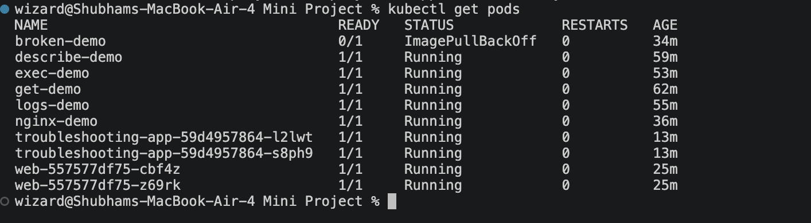

**Wide view (adds IP and node):**

```bash
kubectl get pods -o wide
```

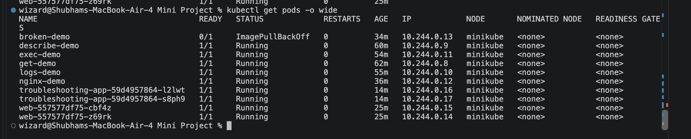

**View deployments:**

```bash
kubectl get deployment
```

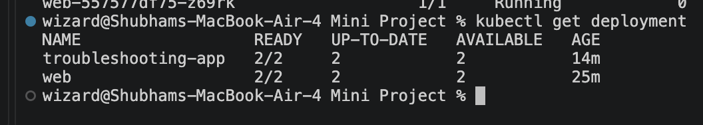

---

### 2. `kubectl describe` — Detailed resource information

```bash
kubectl describe pod <web-pod-name>
```

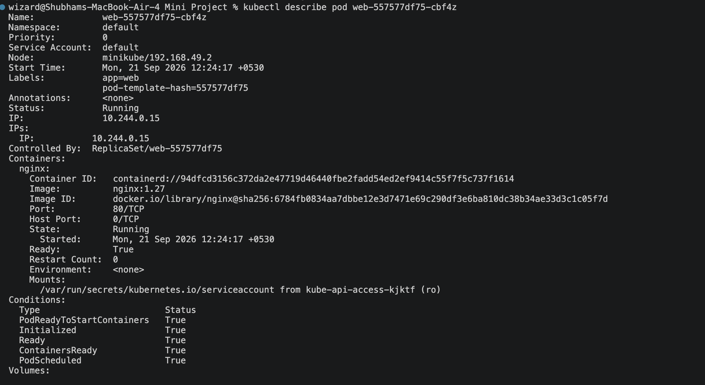

---

### 3. `kubectl logs` — Application output

```bash
kubectl logs <web-pod-name>
```

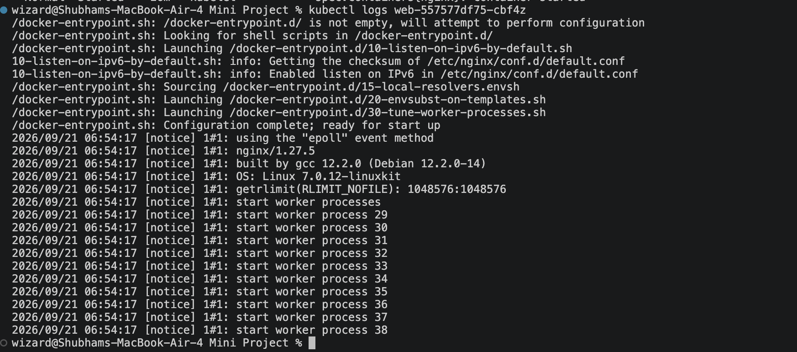

---

### 4. `kubectl exec` — Run commands inside the container

```bash
kubectl exec -it <web-pod-name> -- sh
# inside the container:
hostname
ls /usr/share/nginx/html
cat /etc/os-release
exit
```

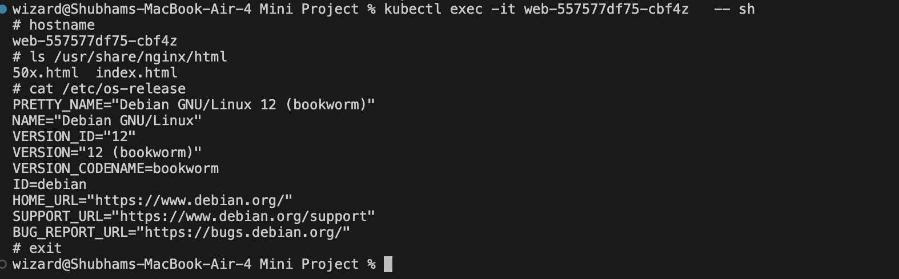

---

### 5. `Events` — What Kubernetes tried to do

```bash
kubectl get events --sort-by='.lastTimestamp'
```

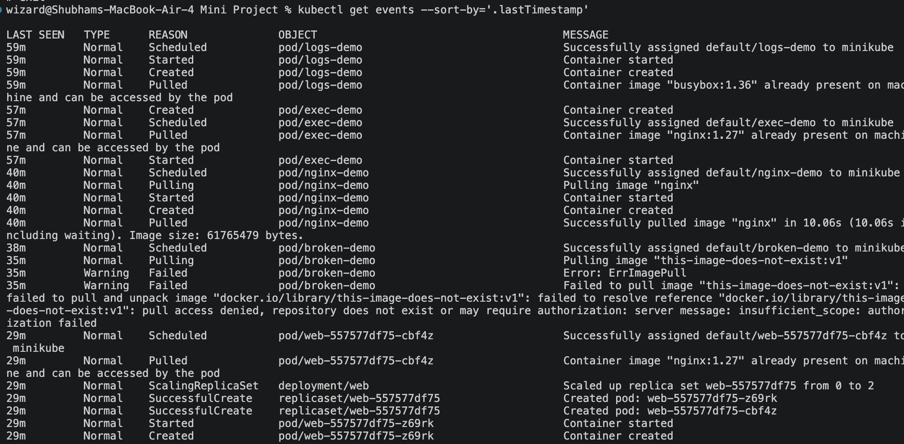

---

### 6. `CrashLoopBackOff` — Container keeps crashing

```bash
kubectl run crashloop --image=busybox -- /bin/sh -c "echo starting; sleep 3; echo crashing now; exit 1"
# wait ~30s for it to restart a few times
kubectl get pods
kubectl logs crashloop
kubectl logs crashloop --previous
kubectl describe pod crashloop
```

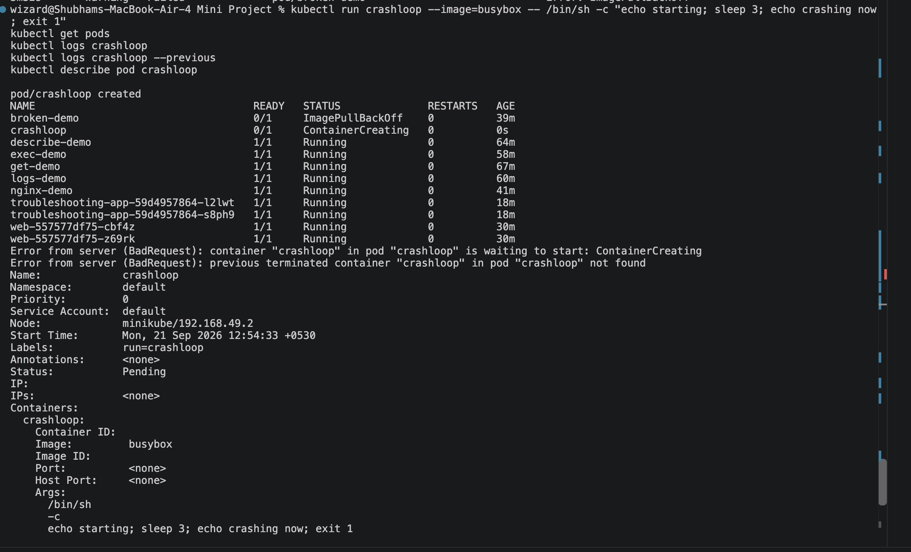

---

### 7. `ImagePullBackOff` — Image cannot be pulled

```bash
kubectl run imagepull --image=this-image-does-not-exist:v1
kubectl get pods
kubectl describe pod imagepull
```

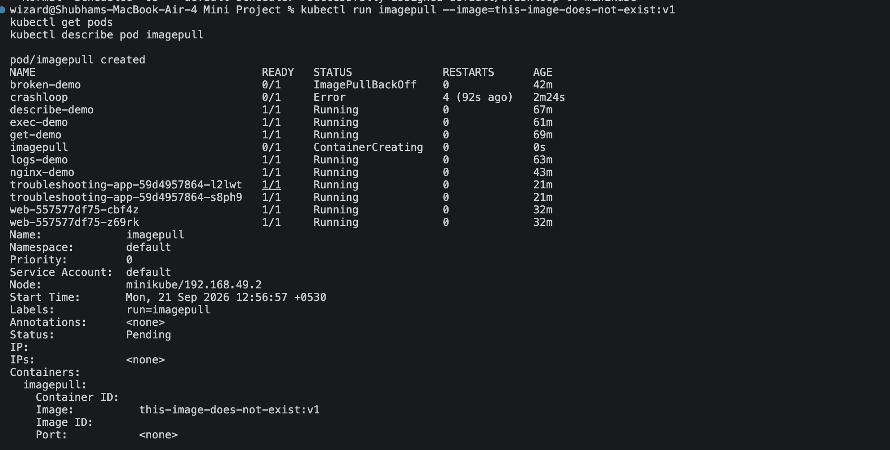

---

### 8. `Pending Pod` — Cannot be scheduled

```bash
kubectl run pending-pod --image=nginx \
  --overrides='{"spec":{"containers":[{"name":"pending-pod","image":"nginx","resources":{"requests":{"cpu":"100"}}}]}}'
kubectl get pods
kubectl describe pod pending-pod
```

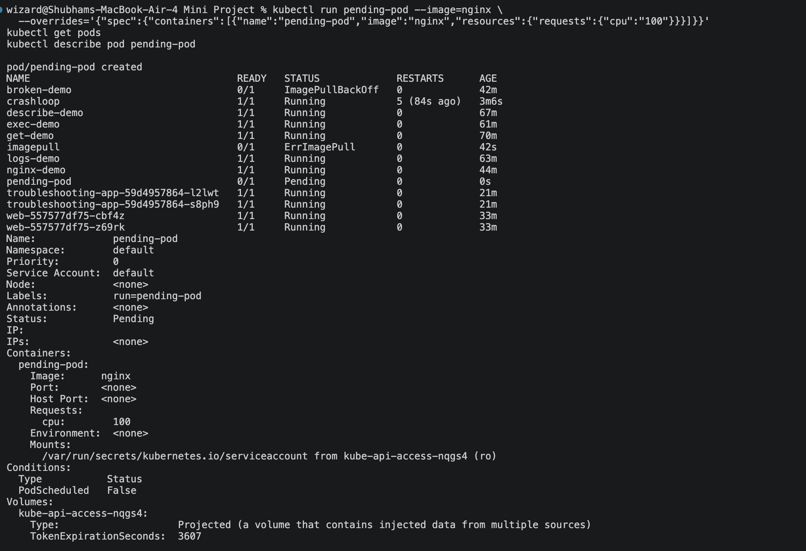

---

### 9a. `Service Troubleshooting` — Selector, endpoints match

```bash
kubectl expose deployment web --port=80 --name=web-service
kubectl get service
kubectl get endpoints web-service
kubectl describe service web-service
```

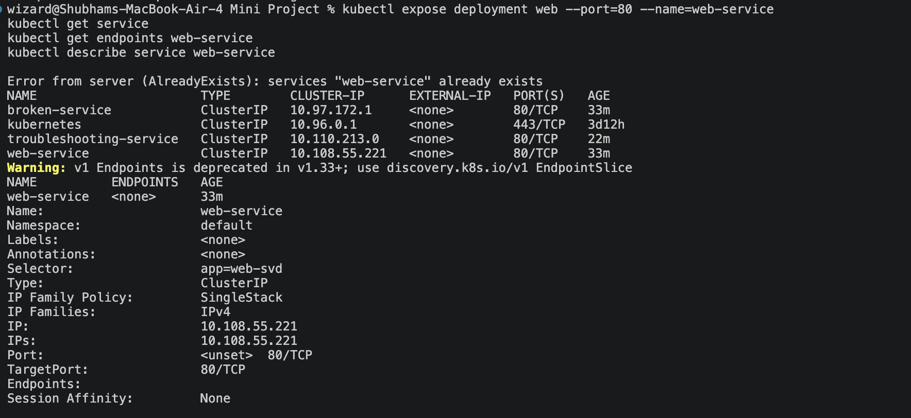

---

### 9b. `DNS Troubleshooting` — Resolve a service name

```bash
kubectl run dnsutils --image=busybox:1.36 --command -- sleep 3600
kubectl exec -it dnsutils -- nslookup web-service
kubectl exec -it dnsutils -- nslookup kubernetes.default
# CoreDNS health
kubectl get pods -n kube-system -l k8s-app=kube-dns
kubectl logs -n kube-system -l k8s-app=kube-dns --tail=20
```

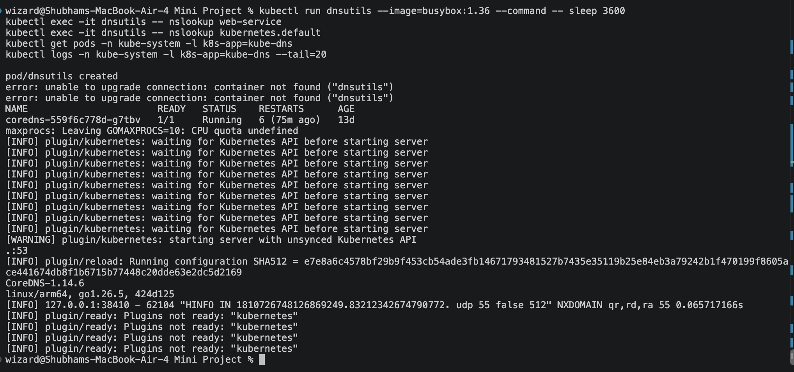

---

### Cleanup

```bash
kubectl delete deployment web
kubectl delete service web-service
kubectl delete pod crashloop imagepull pending-pod dnsutils
```